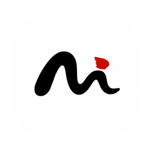
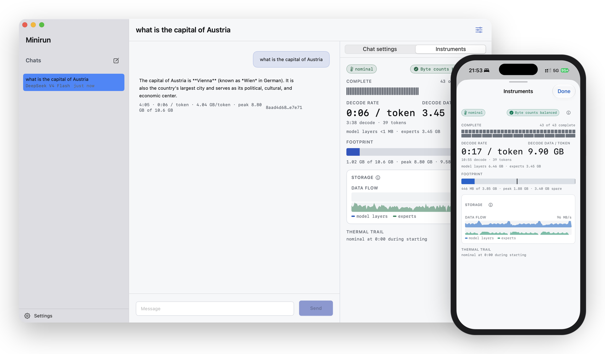
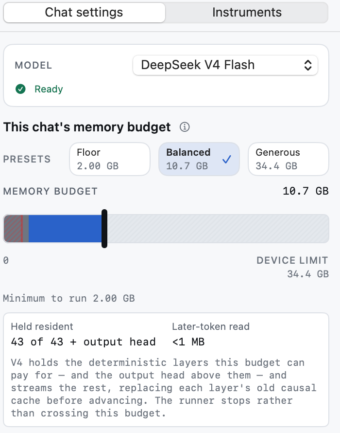
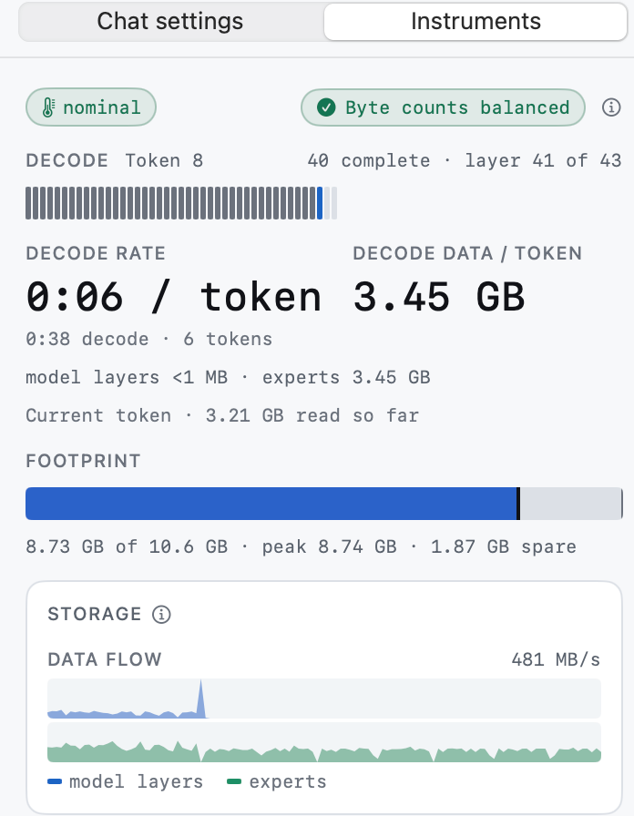
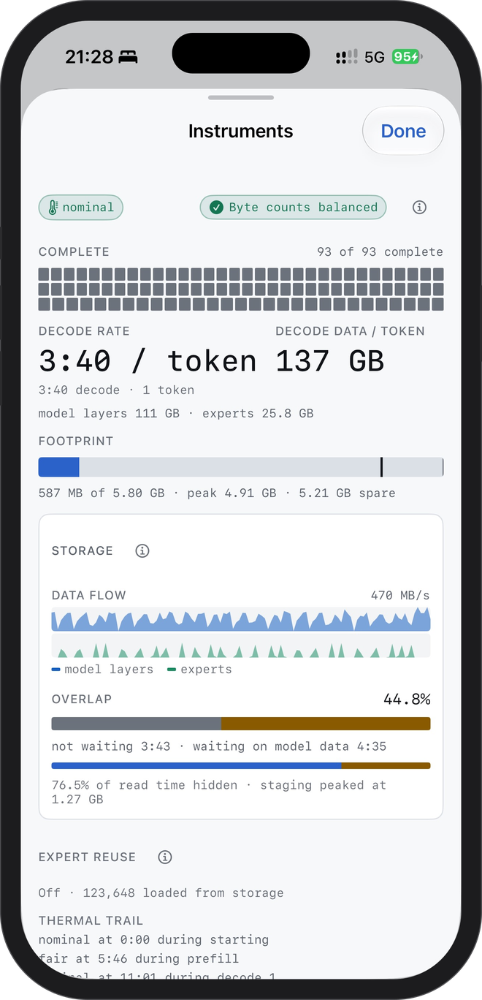

<p align="center">
  
</p>

<h1 align="center">Minirun</h1>

<p align="center"><strong>Run models larger than memory.</strong><br>
Weights stream from your SSD through a memory budget you set. Free, local, on Mac and iPhone.</p>

<p align="center">English | <a href="README.zh-CN.md">简体中文</a></p>

<p align="center">
  <a href="https://downloads.minirun.dev/Minirun.dmg"></a>
  <a href="https://github.com/nanguoyu/minirun-app/actions/workflows/ci.yml"></a>
  <a href="CHANGELOG.md"></a>
  
  
  
  <a href="LICENSE"></a>
  <a href="https://minirun.dev"></a>
</p>

<p align="center">
  
</p>

Minirun is a native macOS and iOS app that runs open models whose weights are
far larger than the device's memory. Instead of loading a model, it reads each
layer — and only the experts the router picks — from an external NVMe SSD into a
small, fixed set of buffers, hands them to [MLX](https://github.com/ml-explore/mlx)
without copying, and releases them. The amount of memory in use is a number you
choose before the run, and the runtime refuses a budget it cannot honor rather
than exceeding it later.

- **Bigger than memory.** Kimi K3 (2.8 T parameters, 1.56 TB on disk) runs on
  an iPhone 16 Pro. DeepSeek V4 Flash (167 GB) holds a conversation on a Mac and
  on that phone.
- **A memory budget you set.** Floor, Balanced, Generous, or a number of your
  own. Minirun keeps resident what the budget pays for and streams the rest;
  the answer is byte-identical at every budget.
- **Runs from your SSD.** Add a folder on an external drive; Minirun finds the
  Minirun containers in it and streams their weights straight off it. Nothing
  is copied to the internal disk.
- **Verified before it runs.** Every file is digested against the published
  Hugging Face tree once; the runtime opens files only through descriptors
  from that verified set. Prompts, answers and telemetry never leave the device.
- **Instruments.** Decode rate, bytes read per token, footprint against the
  budget and the flow from storage, live while the model answers.

## Models

Containers are byte-preserving repacks of the published checkpoints (no
requantization), published at [huggingface.co/nanguoyu](https://huggingface.co/nanguoyu)
and listed at [minirun.dev/models](https://minirun.dev/models). Speeds below
are what the app shows on the reference devices — a MacBook Pro (M1 Pro, 32 GB)
over a USB4 (40 Gb/s) enclosure, and an iPhone 16 Pro over its USB 3 port with a
powered dock — and change with the drive, cable and budget.

| Model | On disk | Mac (M1 Pro, 32 GB) | iPhone 16 Pro | Status |
| --- | ---: | --- | --- | --- |
| [DeepSeek V4 Flash](https://minirun.dev/models/deepseek-v4-flash-0731) — 284 B MoE | 167 GB | ≈ 2.5 s / token, 10.7 GB budget; runs at 2 GB | ≈ 17 s / token, under 2 GB | Chat ready |
| [Kimi K3](https://minirun.dev/models/kimi-k3) — 2.8 T MoE | 1.56 TB | ≈ 70 s / token, 8 GB budget | ≈ 220 s / token, 5.8 GB budget, 2-token replies | Chat ready |
| [MiniMax H3](https://minirun.dev/models/minimax-h3) — audio & video generation | 64 GB | download, verify and store | download, verify and store | Container ready |
| Qwen3.8-27B | — | — | — | Coming soon |

<p align="center">
  
  &nbsp;&nbsp;
  
  &nbsp;&nbsp;
  
</p>

## What you need

- **Mac:** Apple silicon, macOS 15 or later.
- **iPhone:** iPhone 15 Pro or later (a USB 3 port), iOS 18 or later.
- **An external NVMe SSD** with room for the model — 2 TB for Kimi K3, 256 GB
  for DeepSeek V4 Flash. The enclosure and cable decide your speed more than
  the SSD does: use a USB4/Thunderbolt-rated cable, plug straight into the Mac,
  and on the iPhone hang the enclosure off a powered dock (the phone's port
  cannot power an NVMe enclosure by itself).

## Get Minirun

**Mac.** Download [Minirun.dmg](https://downloads.minirun.dev/Minirun.dmg),
drag Minirun to Applications, open it. The app is signed and notarized, and
checks for updates itself (Sparkle).

**iPhone.** Build it from this repository and install it with Xcode:

1. Open `Apps/Minirun/Minirun.xcodeproj`, select the `Minirun-iOS` scheme and
   your iPhone.
2. In *Signing & Capabilities* pick your Apple Developer team and change the
   bundle identifier to one of your own (a free personal team works; the app
   then re-signs every seven days).
3. On the phone, enable *Settings → Privacy & Security → Developer Mode*, then
   press Run. Or from a terminal:

   ```sh
   xcodebuild build -project Apps/Minirun/Minirun.xcodeproj \
     -scheme Minirun-iOS -destination 'generic/platform=iOS' \
     DEVELOPMENT_TEAM=YOUR_TEAM_ID \
     PRODUCT_BUNDLE_IDENTIFIER=com.example.minirun \
     -allowProvisioningUpdates
   ```

TestFlight is coming; until then this is the iPhone route.

## Quick start

1. **Add storage.** *Settings → Storage → Add a folder…* and pick a folder on
   the external drive (on iPhone, through the Files app). Minirun assesses the
   drive and lists the containers it finds.
2. **Get a model.** *Settings → Models → Find Models* shows the published
   containers; download one into that folder, or point at a copy you already
   have.
3. **Verify.** *Verify all files* digests the container against its published
   tree. On iPhone this continues in the background and finishes with a
   notification.
4. **Chat.** New chat, pick the model, pick a budget, send.

The full guide is at [minirun.dev/docs](https://minirun.dev/docs).

## Build and test from source

Requirements: an Apple-silicon Mac, macOS 15 or later, Xcode 26 or newer.

```sh
# Mac app, no signing team needed
xcodebuild build -project Apps/Minirun/Minirun.xcodeproj \
  -scheme Minirun-macOS -destination 'platform=macOS' CODE_SIGNING_ALLOWED=NO

# iOS app for the Simulator (needs an iOS platform installed in Xcode)
xcodebuild build -project Apps/Minirun/Minirun.xcodeproj \
  -scheme Minirun-iOS -destination 'generic/platform=iOS Simulator' CODE_SIGNING_ALLOWED=NO

# Tests: the app suite, then the package suites (use xcodebuild, not swift test)
xcodebuild test -project Apps/Minirun/Minirun.xcodeproj \
  -scheme Minirun-macOS -destination 'platform=macOS' CODE_SIGNING_ALLOWED=NO
xcodebuild test -scheme minirun-Package -destination 'platform=macOS' \
  -only-testing:MinirunKitTests -only-testing:MinirunRunnersTests
```

The Xcode project is generated from `Apps/Minirun/project.yml`; after editing
it, run `xcodegen generate` in `Apps/Minirun`
([XcodeGen](https://github.com/yonaskolb/XcodeGen)).

## Repository layout

| Path | What it is |
| --- | --- |
| `Apps/Minirun/` | The SwiftUI app — one source tree for macOS and iOS |
| `Sources/MinirunKit/` | Catalog, download, verification, storage lifecycle, memory planning, the runner protocol (no MLX) |
| `Sources/MinirunRunners/` | Binds verified containers to the K3 and V4 runtimes |
| `Sources/ModelAdapters/` | Model layouts, streaming caches and operators on MLX |
| `Sources/MLXBridge/` | The thin boundary between storage and MLX |
| `Sources/StorageCore/` | Bounded reads, containers, scheduling — Foundation and Darwin only |
| `Sources/BenchScenarios/` | Reproducible decode scenarios used by the tests |
| `Tests/` | Package tests; `Apps/Minirun/Tests/` holds the app suite |
| `docs/ARCHITECTURE.md` | Dependency direction and the rules behind it |

Model weights are external artifacts governed by their own licenses; this
repository grants no rights to any weights.

## Contributing

Contributions are welcome under Apache-2.0. Every commit is signed off under
the [Developer Certificate of Origin 1.1](DCO); see
[CONTRIBUTING.md](CONTRIBUTING.md). Report security issues privately as
described in [SECURITY.md](SECURITY.md).

## License and marks

Copyright (c) 2026 Dong Wang. Source code is licensed under the
[Apache License 2.0](LICENSE); see [NOTICE](NOTICE) and
[THIRD_PARTY_NOTICES.md](THIRD_PARTY_NOTICES.md). The license does not grant
rights to the Minirun name and logo; see [TRADEMARKS.md](TRADEMARKS.md).

Website: [minirun.dev](https://minirun.dev) · Docs: [minirun.dev/docs](https://minirun.dev/docs) · Contact: [minirun.dev/contact](https://minirun.dev/contact)
