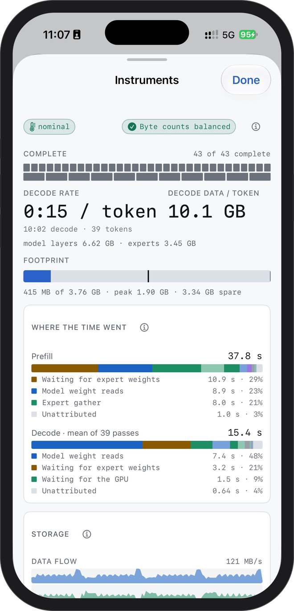
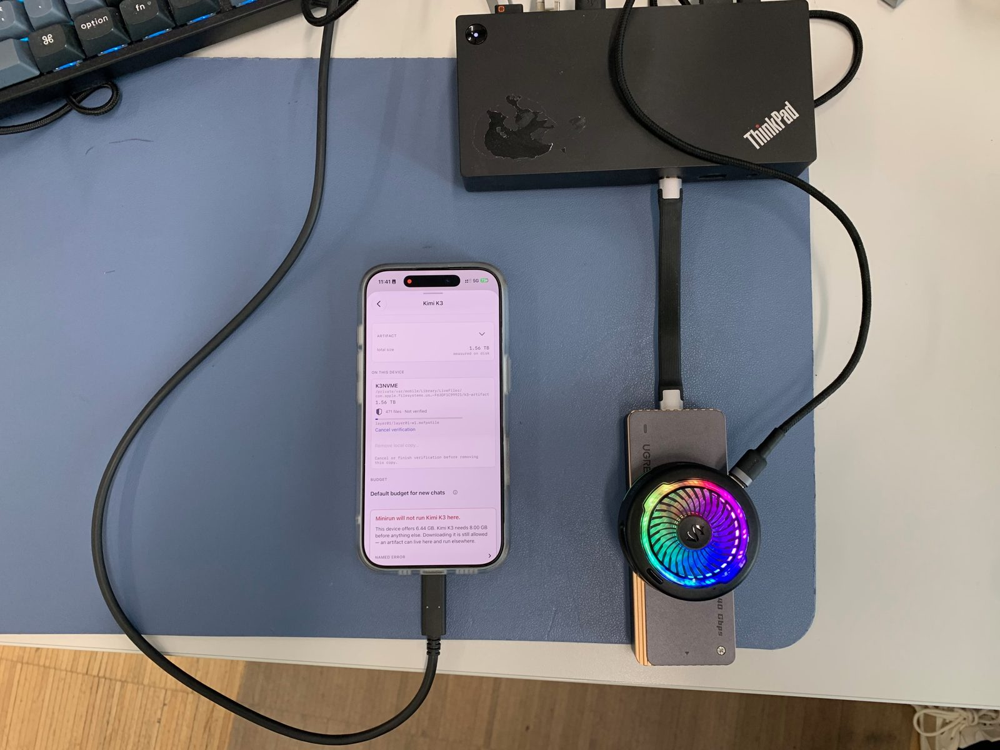

<p align="center">
  
</p>

<h1 align="center">Minirun</h1>

<p align="center"><strong>运行比内存更大的模型。</strong><br>
权重从你的 SSD 按需流入，内存预算由你决定。免费、本地，Mac 和 iPhone 都能用。</p>

<p align="center"><a href="README.md">English</a> | 简体中文</p>

<p align="center">
  <a href="https://downloads.minirun.dev/Minirun.dmg"></a>
  <a href="https://github.com/nanguoyu/minirun-app/actions/workflows/ci.yml"></a>
  <a href="CHANGELOG.md"></a>
  
  
  
  <a href="LICENSE"></a>
  <a href="https://minirun.dev"></a>
</p>

<p align="center">
  
</p>

Minirun 是一个原生的 macOS 与 iOS 应用，用来运行权重远大于设备内存的开源模型。它不"加载"模型：每一层（以及路由器选中的那几个专家）在需要时才从外接 NVMe SSD 读进一小池固定的缓冲区，零拷贝交给 [MLX](https://github.com/ml-explore/mlx) 计算，用完释放。占用多少内存是你在运行前定下的一个数；预算不够跑一层时，运行时直接拒绝启动，而不是先答应再超出。

- **比内存大。** Kimi K3（2.8 万亿参数，磁盘上 1.56 TB）能在 iPhone 16 Pro 上运行。DeepSeek V4 Flash（167 GB）在 Mac 和这部手机上都能完整对话。
- **内存预算你说了算。** Floor、Balanced、Generous 三档预设，或者自己填一个数。预算付得起的部分常驻，其余流式读取；无论哪档预算，答案逐字节相同。
- **直接从 SSD 运行。** 在外接盘上加一个文件夹，Minirun 会找到里面的 Minirun 容器并直接从盘上流式读取权重。不会往内置磁盘复制任何东西。
- **先验证，再运行。** 每个文件都会与 Hugging Face 上发布的文件树核对摘要，且只做一次；运行时只通过这组已验证文件的描述符读取。提示词、回答和遥测数据都不会离开设备。
- **Instruments 面板。** 解码速度、每 token 读取字节数、相对预算的内存占用、来自存储的数据流，在模型作答时实时可见。

## 模型

容器是对已发布 checkpoint 的逐字节重新打包（不重新量化），发布在 [huggingface.co/nanguoyu](https://huggingface.co/nanguoyu)，列表见 [minirun.dev/models](https://minirun.dev/models)。下表速度是 app 在两台参考设备上显示的数值：MacBook Pro（M1 Pro，32 GB）经 USB4（40 Gb/s）硬盘盒，以及 iPhone 16 Pro 经其 USB 3 接口加供电底座；换硬盘、线材或预算，数字都会变。

| 模型 | 磁盘占用 | Mac（M1 Pro，32 GB） | iPhone 16 Pro | 状态 |
| --- | ---: | --- | --- | --- |
| [DeepSeek V4 Flash](https://minirun.dev/models/deepseek-v4-flash-0731)，284B MoE | 167 GB | 约 1.7 秒/token，预算 10.7 GB；2 GB 也能跑 | 约 15 秒/token，预算 3.8 GB；2 GB 也能跑 | 可对话 |
| [Kimi K3](https://minirun.dev/models/kimi-k3)，2.8T MoE | 1.56 TB | 约 70 秒/token，预算 8 GB | 约 220 秒/token，预算 5.8 GB，每轮 2 个 token | 可对话 |
| [MiniMax H3](https://minirun.dev/models/minimax-h3)，音频与视频生成 | 64 GB | 下载、验证、存储 | 下载、验证、存储 | 容器就绪 |
| Qwen3.8-27B | — | — | — | 即将推出 |

<p align="center">
  
  &nbsp;&nbsp;
  
  &nbsp;&nbsp;
  
  &nbsp;&nbsp;
  
</p>

## 你需要什么

- **Mac：** Apple silicon，macOS 15 或更新。
- **iPhone：** iPhone 15 Pro 或更新（需要 USB 3 接口），iOS 18 或更新。
- **一块外接 NVMe SSD**，容量放得下模型：Kimi K3 需要 2 TB，DeepSeek V4 Flash 需要 256 GB。硬盘盒和线比 SSD 本身更决定速度：用 USB4 / 雷电规格的线，直插 Mac，不经 hub；iPhone 上要把硬盘盒接在带供电的底座上（手机接口带不动 NVMe 硬盘盒）。

<p align="center">
  <br>
  <sub>全部装备：手机、一个 USB4 NVMe 硬盘盒、一个供电底座。Kimi K3 就在那块盘上。</sub>
</p>

## 获取 Minirun

**Mac。** 下载 [Minirun.dmg](https://downloads.minirun.dev/Minirun.dmg)，把 Minirun 拖进"应用程序"，打开即可。应用已签名并经 Apple 公证，通过 Sparkle 自动检查更新。

**iPhone。** 从本仓库用 Xcode 构建并安装：

1. 打开 `Apps/Minirun/Minirun.xcodeproj`，选择 `Minirun-iOS` scheme 和你的 iPhone。
2. 在 *Signing & Capabilities* 里选择你的 Apple 开发者团队，并把 bundle identifier 改成你自己的（免费的个人团队也可以，只是应用每七天需要重新签名一次）。
3. 在手机上打开 *设置 → 隐私与安全性 → 开发者模式*，然后点 Run。也可以在终端里：

   ```sh
   xcodebuild build -project Apps/Minirun/Minirun.xcodeproj \
     -scheme Minirun-iOS -destination 'generic/platform=iOS' \
     DEVELOPMENT_TEAM=YOUR_TEAM_ID \
     PRODUCT_BUNDLE_IDENTIFIER=com.example.minirun \
     -allowProvisioningUpdates
   ```

TestFlight 在准备中；在此之前，iPhone 版走这条路。

## 快速开始

1. **添加存储。** *Settings → Storage → Add a folder…*，选外接盘上的一个文件夹（iPhone 上通过"文件"app 选择）。Minirun 会评估这块盘并列出其中找到的容器。
2. **获取模型。** *Settings → Models → Find Models* 会显示已发布的容器；下载一个到那个文件夹，或者指向你已有的副本。
3. **验证。** *Verify all files* 会把容器与其发布的文件树逐一核对摘要。iPhone 上验证会在后台继续，完成后发通知。
4. **对话。** 新建对话，选模型，选预算，发送。（应用界面目前为英文。）

完整指南见 [minirun.dev/docs](https://minirun.dev/docs)。

## 从源码构建与测试

要求：Apple silicon 的 Mac，macOS 15 或更新，Xcode 26 或更新。

```sh
# Mac 应用，不需要签名团队
xcodebuild build -project Apps/Minirun/Minirun.xcodeproj \
  -scheme Minirun-macOS -destination 'platform=macOS' CODE_SIGNING_ALLOWED=NO

# iOS 应用（模拟器；需要在 Xcode 中安装 iOS 平台）
xcodebuild build -project Apps/Minirun/Minirun.xcodeproj \
  -scheme Minirun-iOS -destination 'generic/platform=iOS Simulator' CODE_SIGNING_ALLOWED=NO

# 测试：先跑应用套件，再跑包套件（用 xcodebuild，不要用 swift test）
xcodebuild test -project Apps/Minirun/Minirun.xcodeproj \
  -scheme Minirun-macOS -destination 'platform=macOS' CODE_SIGNING_ALLOWED=NO
xcodebuild test -scheme minirun-Package -destination 'platform=macOS' \
  -only-testing:MinirunKitTests -only-testing:MinirunRunnersTests
```

Xcode 工程由 `Apps/Minirun/project.yml` 生成；改动后在 `Apps/Minirun` 目录运行 `xcodegen generate`（[XcodeGen](https://github.com/yonaskolb/XcodeGen)）。

## 仓库结构

| 路径 | 内容 |
| --- | --- |
| `Apps/Minirun/` | SwiftUI 应用，macOS 与 iOS 共用一套源码 |
| `Sources/MinirunKit/` | 目录、下载、验证、存储生命周期、内存规划、runner 协议（不含 MLX） |
| `Sources/MinirunRunners/` | 把已验证的容器接到 K3 与 V4 运行时 |
| `Sources/ModelAdapters/` | 基于 MLX 的模型布局、流式缓存与算子 |
| `Sources/MLXBridge/` | 存储与 MLX 之间的薄边界 |
| `Sources/StorageCore/` | 有界读取、容器、调度；只依赖 Foundation 和 Darwin |
| `Sources/BenchScenarios/` | 测试使用的可复现解码场景 |
| `Tests/` | 包测试；`Apps/Minirun/Tests/` 是应用测试套件 |
| `docs/ARCHITECTURE.md` | 依赖方向及其背后的规则 |

模型权重是外部产物，受各自许可证约束；本仓库不授予任何权重的使用权。

## 参与贡献

欢迎在 Apache-2.0 下贡献。每个提交都需按 [Developer Certificate of Origin 1.1](DCO) 署名（`git commit -s`），详见 [CONTRIBUTING.md](CONTRIBUTING.md)。安全问题请按 [SECURITY.md](SECURITY.md) 的方式私下报告。

## 许可与商标

Copyright (c) 2026 Dong Wang。源码采用 [Apache License 2.0](LICENSE)，另见 [NOTICE](NOTICE) 与 [THIRD_PARTY_NOTICES.md](THIRD_PARTY_NOTICES.md)。该许可不授予 Minirun 名称与标志的使用权，见 [TRADEMARKS.md](TRADEMARKS.md)。

官网：[minirun.dev](https://minirun.dev) · 文档：[minirun.dev/docs](https://minirun.dev/docs) · 联系：[minirun.dev/contact](https://minirun.dev/contact)
